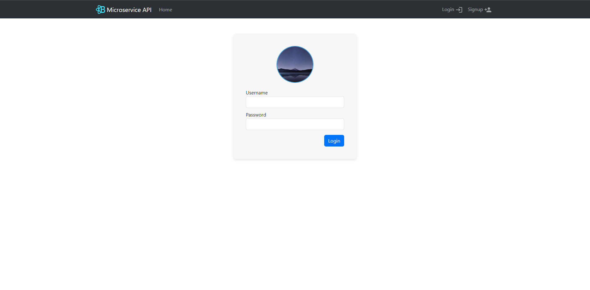
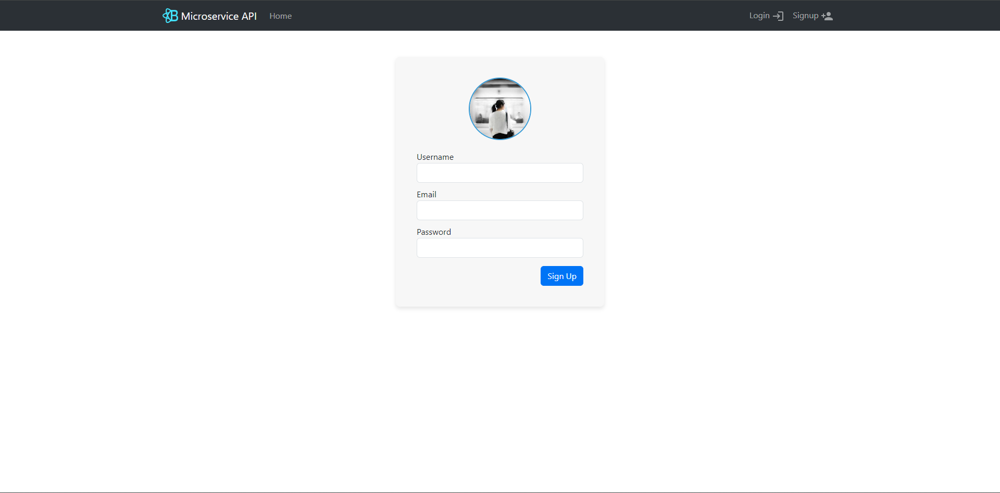
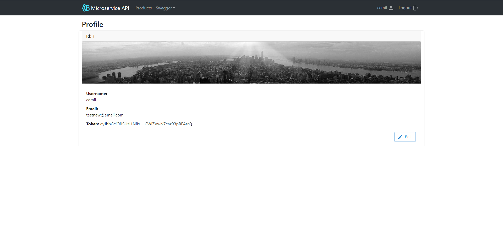
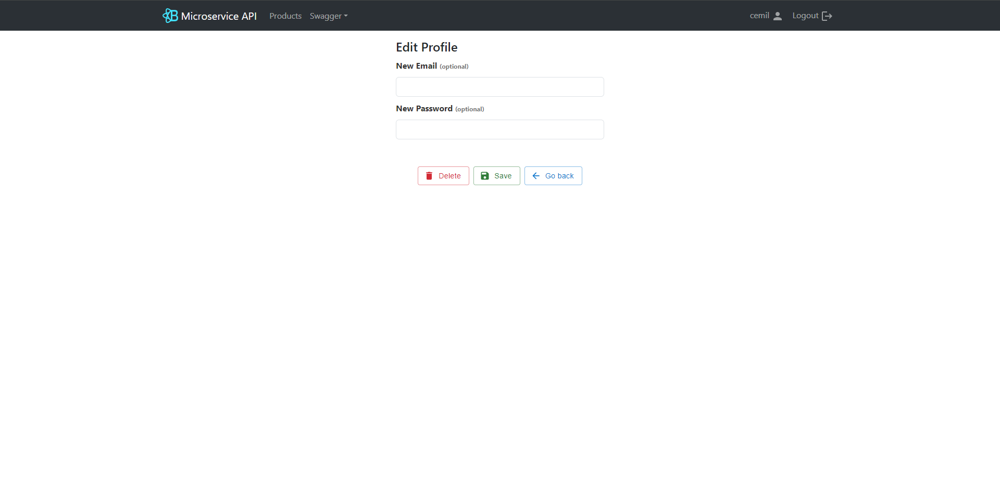
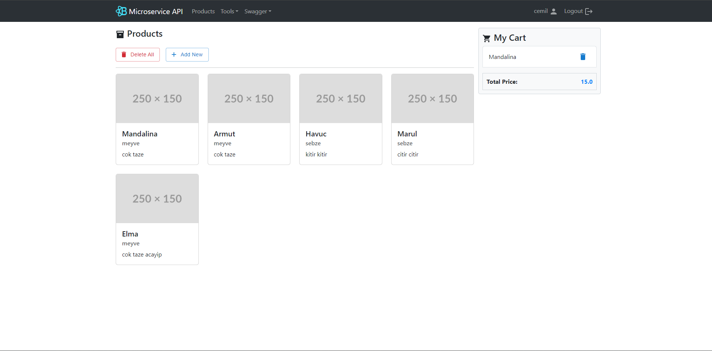
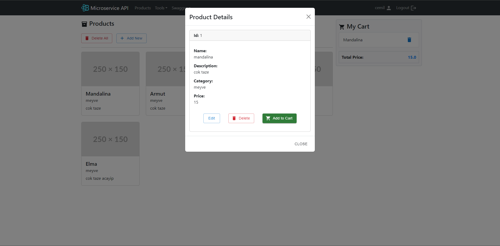
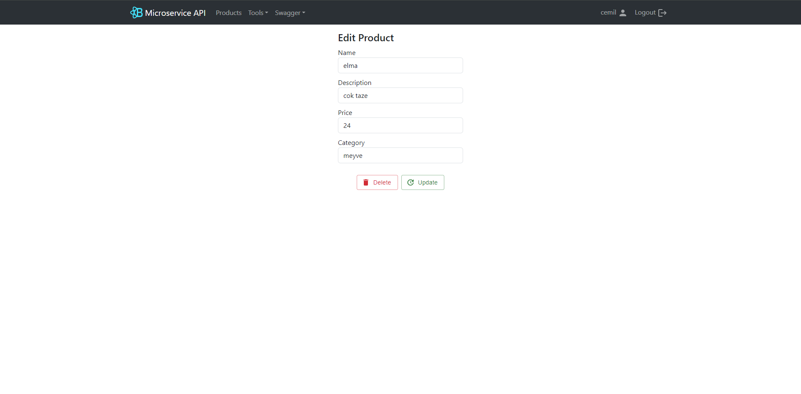
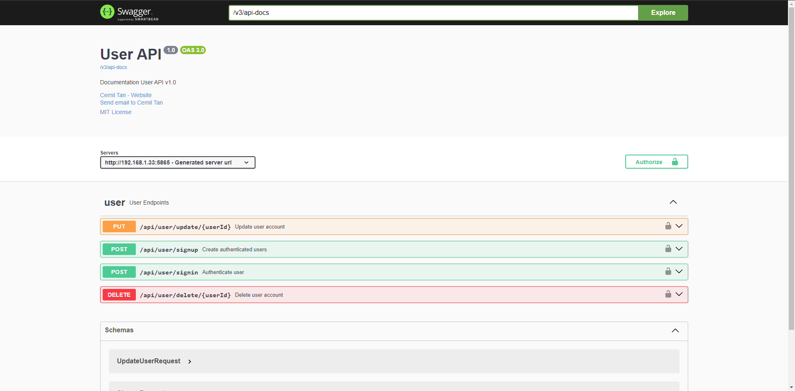
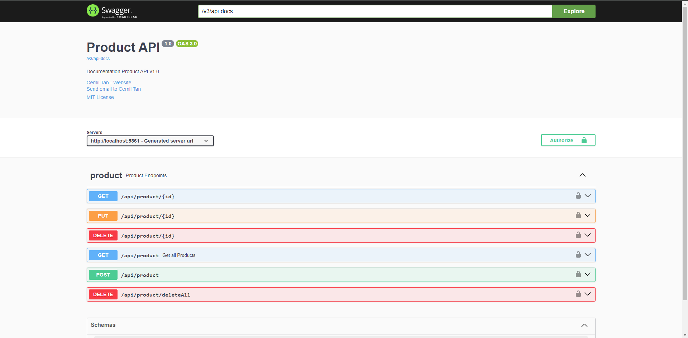
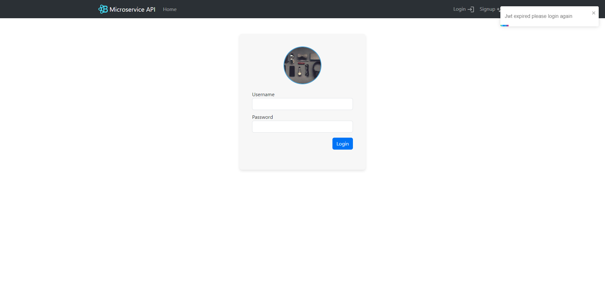

<h1 align="center">
  Spring-boot-microservice React
  
 
  
  
  
  
  
  
  <br>
</h1>

<p align="center">
  <a href="#ℹ%EF%B8%8F-introduction">Introduction</a> •
  <a href="#installation-guide">Installation Guide</a> •
  <a href="#screenshots">Screenshots</a> •
  <a href="#license">License</a> •
  <a href="#contributors">Contributors</a> 
</p>

<div align="center">


</div>

## ℹ️ Introduction

- This is a simple react application to demonstrate how to integrate Spring Boot (Microservice) and React. 
- The application is allows users to register and login. Once the user logs in, they can view a list of products and user's cart. 
- The user can create, edit and delete products and add products to cart. (If any user has a product in their cart, that product cannot be deleted.)
- JWT is used for authentication. 
- Redux is used for state management.

> [!TIP]    
> For more detail about the application, please refer to the following project: [Spring Boot Microservice](https://github.com/Ctere1/spring-boot-microservice) 


## 💾Installation Guide

- To clone and run this application, you'll need [Git](https://git-scm.com) and [Node.js](https://nodejs.org/en/download/) (which comes with [npm](http://npmjs.com)) installed on your computer. From your command line:

  ```bash
  # Clone this repository
  $ git clone https://github.com/Ctere1/spring-boot-microservice-react
  # Go into the repository
  $ cd spring-boot-microservice-react
  # Install dependencies
  $ npm install
  # Run the app
  $ npm start
  ```

## 📷Screenshots

### **Home Page**
> * Home page
> 
>   


### **Login - Signup Pages**
> * User can login on this page
>   
>   
>
> * User can signup on this page
>   
>   


### **Profile Page**
> * User profile page
> 
>   
> 
> * User edit page
>   

### **Products Page**
> * Products page
> 
>   
>
> * Product details modal
>   
>   
>   
> * Product edit page
> 
>   


### **Swagger Documents**
> * User service
> 
>   
>
> * Cart service
> 
>   
>
> * Product service
> 
>   


### **JWT Notification**
> * JWT expired notification
> 
>   

## ©License


## 📌Contributors

<a href="https://github.com/ibrahimgokyar/">
  
</a>

